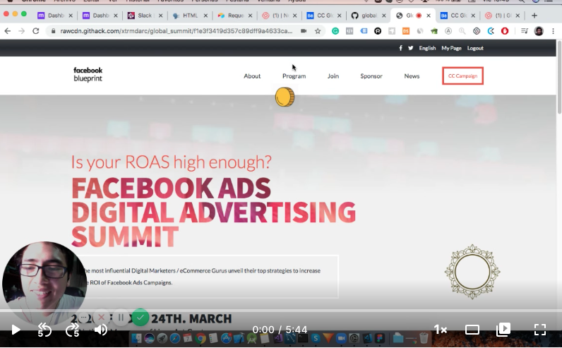
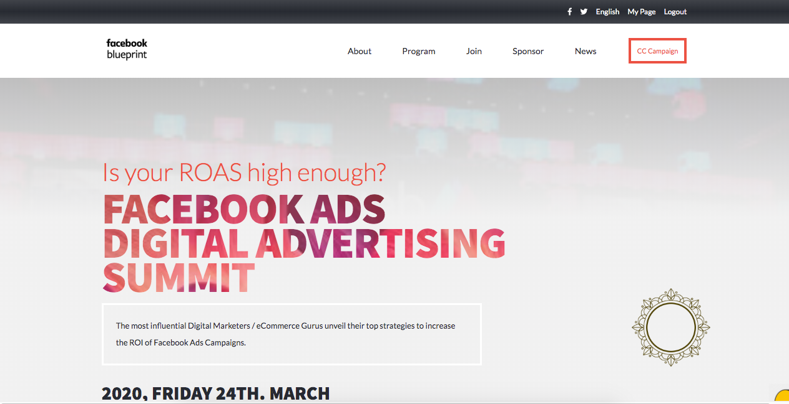
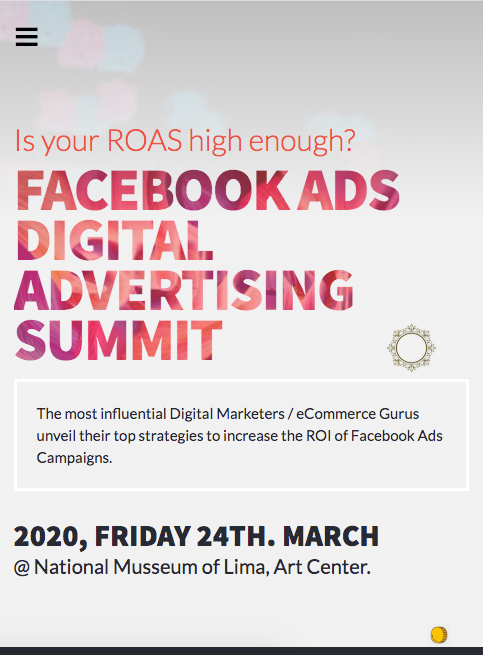
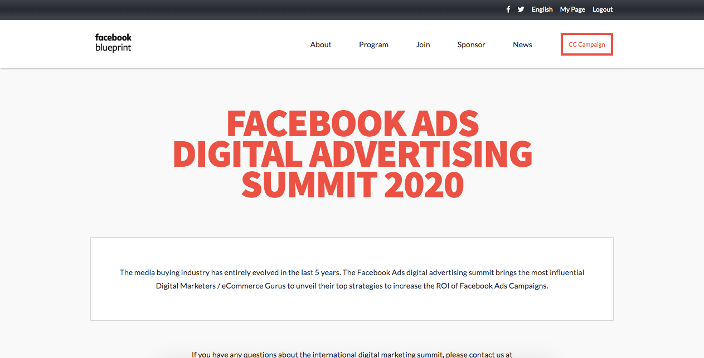
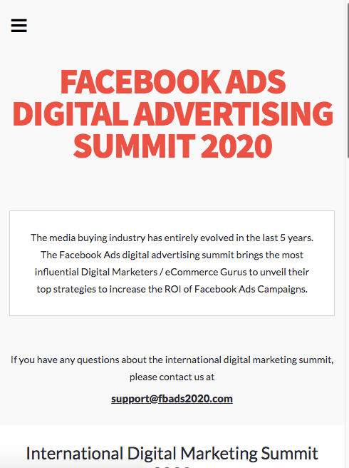
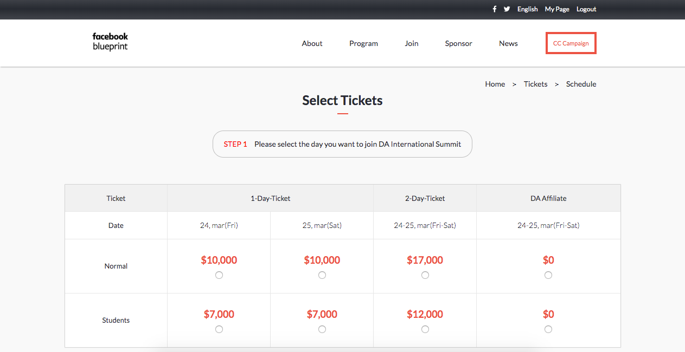
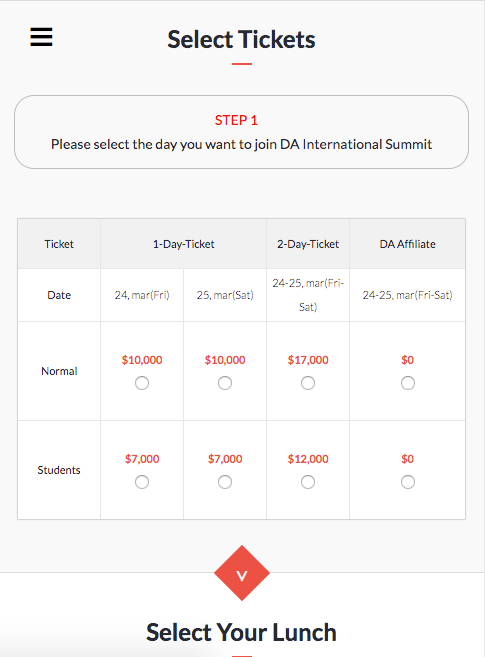

# Facebook Ads Digital Advertising 2020 Summmit

> This is the website of the Facebook Ads Digital Advertising Summit 2020. This project consists of one Landing Page, an About Us Page, and Tickets Shop Page. I developed all of them on my own using pure HTML and CSS with no frameworks. The site is responsive to laptop and mobile resolutions. I added an small bit of JS to make an animation more vivid in the landing page.

# Project Presentation Video

## Landing Page
# Latop View

# Mobile View

## About us Page
# Latop View

# Mobile View

## Tickets Page
# Latop View

# Mobile View

## Built With

- HTML
- CSS
- JS
- Flexbox

## Live Demo

[Live Demo Link](https://rawcdn.githack.com/xtrmdarc/global_summit/f1e3f3419d357c89dff9a4633ca296d249f1edbb/pages/main.html)

### Prerequisites
To make this repository working in your local machine you need only a browser.

## Authors

👤 **Diego Antonio Reyes Coronado**

- Github: [@githubhandle](https://github.com/xtrmdarc)
- Twitter: [@twitterhandle](https://twitter.com/DiegoAn91629127)
- Linkedin: [linkedin](https://www.linkedin.com/in/diego-reyes-coronado-7a7189b7/)

## 🤝 Contributing

Contributions, issues and feature requests are welcome.

Feel free to check the [issues page](https://github.com/xtrmdarc/global_summit/issues).

## Credits

Thanks to [Cindy Shin](https://www.behance.net/adagio07) for her awesome design work. I based my work on  [this](https://www.behance.net/gallery/29845175/CC-Global-Summit-2015?fbclid=IwAR1INBShq5YY_AGeYjrH9O6-jPv275Et9WCwshT9qV8vzkH-3IgQ0VcqRyI) design.

## Show your support

Give a ⭐️ if you like this project!

## License

This project is [MIT](lic.url) licensed.
